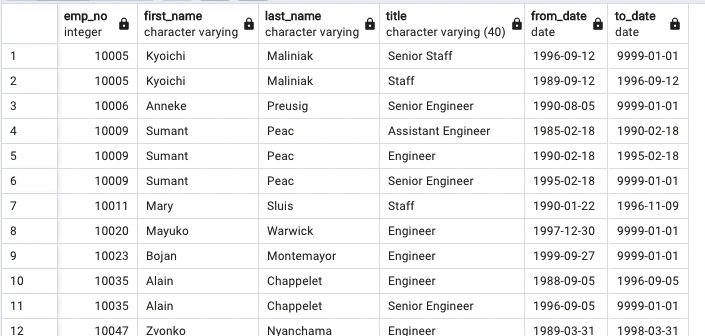
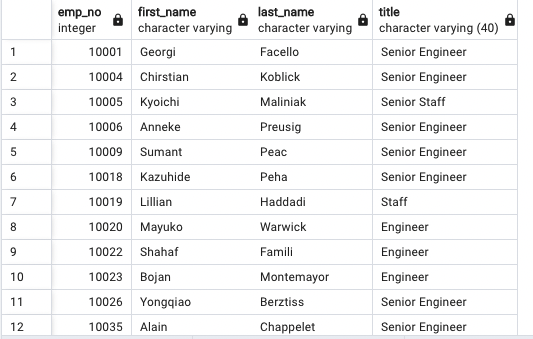
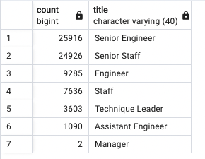
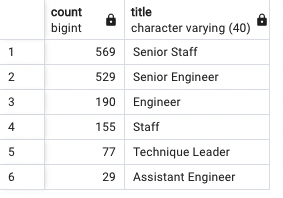

# Pewlett-Hackard-Analysis

## Overview of the analysis:

Pewlett Hackard is a large company boasting several thousand employees and it's been around for a long time. As baby boomers begin to retire at rapit rate Pewlett Hackard is looking toward the future in two ways. First, it's offering a retirement package for those who meet certain criteria. Second, it's starting to think about which positions will need to be filled in the near future. The number of upcoming retirements will leave thousands of job openings. So, company needs to look ahead and prepare for this many vacancies.
In order to perform the necessary analysis and determine the number of retiring employees by title as well as the employees who are qualified to take part in a mentorship program, we were given five excel sheets of raw data to work with. After that, you'll write a report to help Bobby's manager get ready for the "silver tsunami" that will come as many current employees reach retirement age.

## Results:

- To determine which titles required replacement soonest, we first joined the employee and title tables together before filtering by date of birth. The outcome was not ideal because the same employees held various titles, as they switched titles over the years.

  

-  We did another table with unique title for each retiring employee, had to use the DISTINCT ON statement to retrieve the first occurrence of the employee number for each set of rows defined by the ON () clause, as outcome of the first table was not the result we wanted.

   

- Next, we calculated the total number of titles (which also mean the number of employees who meets the requirements for retiring) from unique_titles table and that number is staggering. Finaly, we determine how many employees for each title might retire soon, so company would beter prepare for the "silver tsunami". 

  

- The last table we created was for mentorship eligibility, it means how many current employee are eligible and can start to mentorship new employees.

## Summary:

- There are 72,458 roles will need to be filed as "silver tsunami" begins to make an impact.
- And there are only 1549 qualified, retirement-ready employees in the departments to mentor the next generation of Pewlett Hackard employees.
- I made the decision to make an additional table to determine the number of employees in each title who were qualified to mentor a younger workforce. There are no qualified managers for mentoring, as you can see in the image below, so I would advise to start looking for candidates right away.

  

- I have noticed that there are lots of senior positions going to be retired, so I would suggest hire more junior positions and start training them.